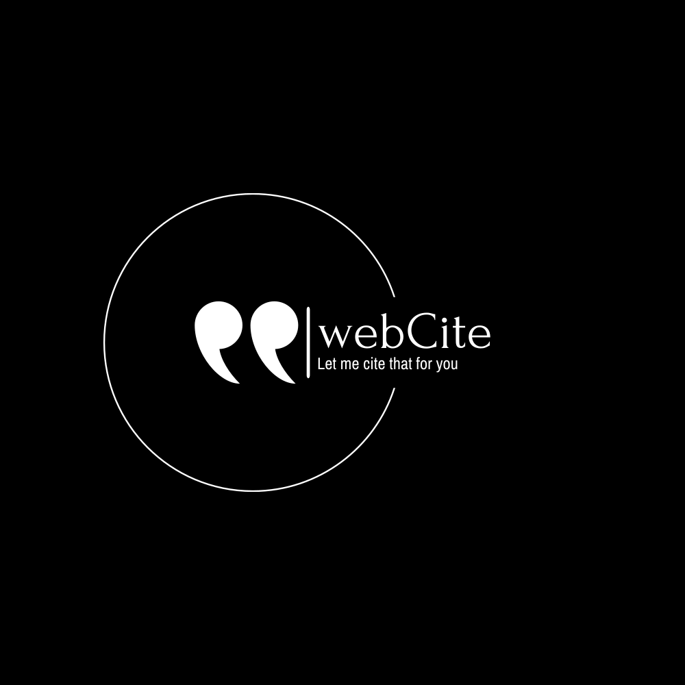

# webCite

WebCite is a versatile reference management app designed to streamline the process of citing online sources. Leveraging three separate API providers and JavaScript react, WebCite offers users a comprehensive solution for creating citations in various styles.

### Teck Stack

#### Build Tool

Built upon Vite JS

#### Website Preview API

[Website Preview API](https://my.linkpreview.net/) is a tool that provides website previews, allowing you to extract essential information such as titles, descriptions, and images from URLs. It's perfect for building engaging link previews in your applications, improving user experience, and increasing user engagement.

#### Research Paper API

The [Research Paper API](https://api.semanticscholar.org/api-docs/#tag/Paper-Data/operation/get_graph_get_paper) by Semantic Scholar offers access to a vast repository of research papers and academic content. With this API, developers can retrieve detailed data about research papers, authors, citations, and more. It's an invaluable resource for those working on academic or research-related projects.

#### Book API

The [Book API](https://openlibrary.org/) from Open Library enables you to search for books and retrieve information about them. Whether you're building a book-related application or conducting research on literary works, this API provides access to a wealth of book data, including titles, authors, publication details, and more.
